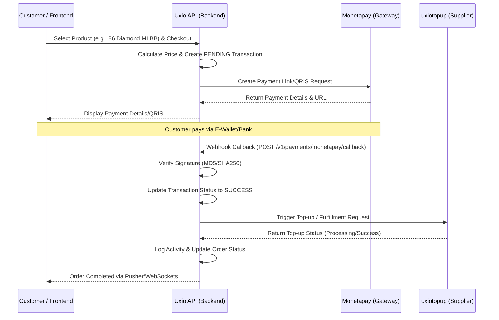

# Payment Gateway & uxiotopup Integration Flow
**Architecture Version:** 1.0
**Framework:** Laravel 11 (AOA)
**Services:** Monetapay (Payment Gateway), uxiotopup (Supplier API)

---

## 1. High-Level Architecture Flow
The system acts as a central broker between the **Customer**, the **Payment Gateway (Monetapay)**, and the **Supplier (uxiotopup)**.

---

## 2. Component Technical Breakdown

### A. Core Master Data (`Supplier` & `Product` Entities)
Before a transaction can occur, the internal catalog must map to the supplier catalog.
- **`Product`**: The internal product displayed to the user (e.g., "86 Diamond MLBB"). Has tiered pricing (`price_member`, `price_vip`).
- **`Supplier`**: The provider of the product (e.g., "Uxiotopup").
- **`SupplierProduct`**: The mapping bridge linking an internal `product_id` to a `buyer_sku_code` (uxiotopup service id). The `is_active` boolean dictates which supplier fulfills the order if multiple exist.

### B. Payment Flow (Monetapay)
The system leverages **Action-Oriented Architecture (AOA)** for testability and isolation.

#### 1. Transaction Creation
* **Class:** `CreateMonetapayTransactionAction`
* **Trigger:** Customer checks out.
* **Flow:**
  1. Internal `Transaction` record created as `PENDING`.
  2. `MonetapayService::createTransaction()` is invoked with `reference_id` and `amount`.
  3. A security `signature` is generated internally before sending the payload to Monetapay.
  4. Response containing the Payment URL/QR string is relayed to the frontend.

#### 2. Callback Handling (Webhook)
* **Route:** `POST /api/v1/payments/monetapay/callback`
* **Class:** `HandleMonetapayCallbackAction`
* **Flow:**
  1. Monetapay pushes the payload indicating `status=SUCCESS`.
  2. The action immediately verifies the incoming `signature`. If mismatched, it throws an `Exception`, logs the event, and halts execution (Security constraint).
  3. The local `Transaction` is marked as `SUCCESS`.
  4. Triggers the internal event/action to fulfill the order via uxiotopup.

### C. Fulfillment Flow (uxiotopup)
*Note: uxiotopup actions are conceptualized here as part of the overall flow.*

#### 1. Top-up Dispatch
* **Trigger:** Triggered automatically upon a successful Monetapay callback.
* **Flow:**
  1. The system identifies the `product_id` purchased in the transaction.
  2. It queries `SupplierProduct` where `product_id = X` and `is_active = true` to find the exact `buyer_sku_code`.
  3. A `ProcessUxiotopupTransactionAction` sends the top-up payload to the uxiotopup API using the `buyer_sku_code` (service id) and our `invoice_number` as `idtrx`.
  4. The local Order status is marked as `PROCESSING` or `COMPLETED` based on the synchronous response.

#### 2. uxiotopup Webhook (Asynchronous Fulfillment)
* **Trigger:** uxiotopup pushes status updates for pending/delayed transactions.
* **Flow:**
  1. Handled by a dedicated `HandleUxiotopupWebhookAction`.
  2. The payload carries no signature — it is authenticated by source IP allowlist (103.146.202.50).
  3. The local Order status is finalized (`SUCCESS` or `FAILED`).
  4. If `FAILED`, a refund logic or manual intervention flag is triggered.

---

## 3. Strict Architectural Rules Applied
1. **BigInteger Pricing:** All currency fields (`amount`, `price_modal`, etc.) are mapped strictly as integers. We do not use decimals or floats to prevent calculation skew during callback processing.
2. **DTO Driven Webhooks:** The Monetapay callback does not inject generic arrays into the Action. The `MonetapayCallbackController` explicitly transforms the payload into a strictly typed, readonly `MonetapayCallbackDTO` to guarantee shape safety.
3. **Explicit Activity Logging:** No Eloquent Observers are used. Every phase of this lifecycle (Transaction Created, Callback Received, Signature Failed, Topup Sent) explicitly invokes `CreateActivityLogAction` with the exact context.
