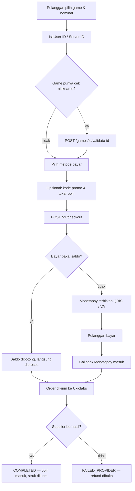
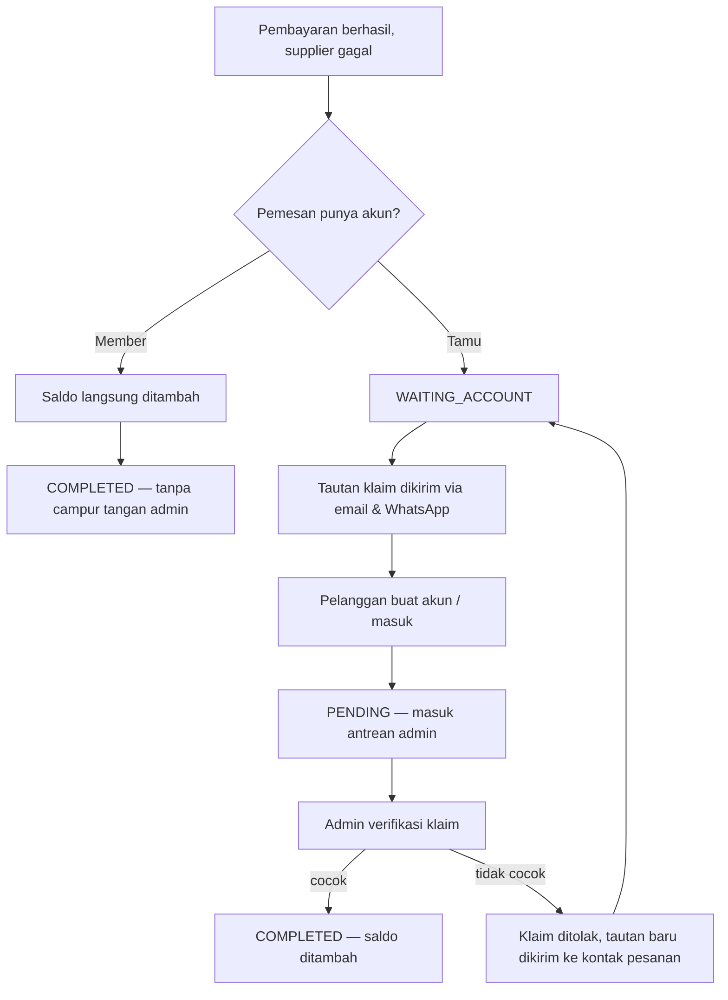

# Alur Website Topup

Empat aplikasi, satu sistem:

| Aplikasi | Siapa penggunanya | Letak |
|---|---|---|
| **Storefront** | Pelanggan — beli diamond, cek pesanan, klaim refund | `apps/storefront` |
| **Panel admin** | Tim internal — produk, harga, transaksi, laporan | `apps/admin` |
| **Uxiolabs Pay** | Klien pemilik situs (`payment-admin`) dan tim keuangan (`payment-internal`) | `apps/payment` |
| **API** | Melayani ketiganya | `apps/api` |

---

## 1. Alur beli — dari pilih game sampai diamond masuk



**Yang perlu diketahui tentang harga.** Harga yang dibayar bukan dari kolom tetap, melainkan hasil `PlanPrice::for(produk, pengguna)` — harga per **paket membership**. Tamu dan member tanpa langganan memakai paket bawaan (Basic). Urutannya di `CheckoutAction`:

```
harga paket membership
  − diskon promo
  − nilai rupiah poin yang ditebus
  = amount_base            ← yang disimpan di baris transaksi
  + biaya admin channel    ← dihitung dari harga SETELAH potongan
  = total yang dibayar
```

Dua akibat yang sering mengejutkan:

- **Pesanan yang lunas seluruhnya dengan poin membayar Rp 0**, jadi tidak dikirim ke gateway mana pun — dan batas minimum channel dilewati. Baris `payments` tetap ditulis dengan nilai nol, karena tanpa itu pesanan tersebut tidak akan pernah bisa direfund.
- **Biaya admin dihitung setelah potongan**, bukan dari harga asli. Pelanggan membayar biaya atas apa yang benar-benar ditagihkan.

**Penjaga margin.** Checkout dibatalkan bila `harga jual − harga supplier < 0`. Harga dan margin **dibekukan** ke baris transaksi saat checkout, jadi perubahan harga supplier keesokan harinya adalah selisih margin, bukan kesalahan hitung.

---

## 2. Mesin status transaksi

```
PENDING ──► PAID ──► PROCESSING ──► COMPLETED
   │                      │
   │                      └──► FAILED_PROVIDER ──► REFUNDED
   └──► EXPIRED
```

| Status | Artinya |
|---|---|
| `PENDING` | Menunggu pembayaran |
| `PAID` | Sudah dibayar, belum diteruskan ke supplier |
| `PROCESSING` | Supplier sedang memproses |
| `COMPLETED` | Diamond sudah masuk |
| `EXPIRED` | Jendela pembayaran habis — **pelanggan tidak pernah membayar** |
| `FAILED_PROVIDER` | **Pelanggan sudah membayar**, supplier yang gagal |
| `REFUNDED` | Uang sudah kembali |

**`REFUNDED` bersifat final.** Supplier bisa mengirim `cancel` lalu `success` belakangan; tanpa penjaga, keberhasilan yang telat akan mengubah pesanan yang sudah direfund menjadi `COMPLETED` setelah uangnya dikembalikan.

**Dua siklus, bukan satu.** `transactions.status` menjawab dua pertanyaan sekaligus — apakah pelanggan sudah bayar, dan apakah supplier sudah kirim — sehingga `PROCESSING` tidak bisa membedakan "supplier sedang memproses" dari "worker antrean belum jalan". Karena itu ada `transactions.provider_status` yang **hanya** menyimpan sisi supplier, dengan tiga keadaan yang tidak bisa diungkapkan status utama:

- `REJECTED` — supplier menolak secara eksplisit. Tidak layak diulang.
- `UNDELIVERED` — percobaan habis tanpa jawaban. **Layak diulang manual.**
- `UNCONFIRMED` — supplier menerima order tapi kita tidak memegang ID-nya, jadi tidak bisa dipantau.

---

## 3. Pengembalian dana

Tidak ada refund otomatis lewat gateway. Semua refund berakhir di sebuah dompet — pertanyaannya hanya dompet siapa, dan secepat apa.



**Kenapa tamu harus membuat akun.** Tidak ada tempat menaruh saldo tanpa akun. Dan tautan klaim **tidak pernah** dikirim lewat halaman invoice — nomor invoice saja tidak membuktikan kepemilikan, sehingga siapa pun yang melihat tangkapan layar bisa mengambil uangnya. Tautan selalu dikirim ulang ke kontak yang tercatat pada pesanan.

**Dua penguncian.** Token klaim hanya disimpan sebagai hash SHA-256, berlaku 30 hari, dan **dihanguskan sekali pakai**. Selain itu email atau nomor telepon akun pengklaim wajib cocok dengan kontak pesanan, dan nilai yang cocok itu **dibekukan** ke baris refund — akun bisa saja mengganti emailnya sebelum admin memeriksa.

**Dua jenis penolakan, sengaja dipisah.** Menolak *refund*-nya menutup perkara (ternyata pesanan berhasil). Menolak *klaim*-nya hanya menolak akunnya: pengklaim dilepas, penghitung penolakan naik, status kembali ke `WAITING_ACCOUNT`, dan tautan baru dikirim **ke kontak pesanan, bukan ke akun yang baru saja ditolak**. Menggabungkan keduanya akan mengubur refund pembeli asli selamanya, karena satu transaksi hanya boleh punya satu baris refund.

**SLA 2×24 jam kerja**, dihitung sejak **klaim**, bukan sejak refund dibuka — selama belum diklaim, yang ditunggu adalah pelanggan. Akhir pekan dan hari libur di `config/refund.php` dilewati.

**`transactions.user_id` tidak pernah ditulis ulang saat klaim.** Kolom itu menggerakkan atribusi merchant dan seluruh laporan; mengalihkannya akan memindahkan penjualan tamu ke riwayat seorang member untuk periode ketika akunnya belum ada. Akibatnya pesanan gagal itu **tidak muncul** di riwayat pesanan member — kreditnya terlihat di mutasi saldo dan di halaman "Pengembalian Dana".

---

## 4. Poin

**Didapat hanya saat `COMPLETED`** — pembayaran lunas *dan* supplier sudah kirim. Pesanan gagal tidak pernah menghasilkan poin yang harus ditarik kembali.

Rumusnya `ceil(amount_base × persen / 100) + nominal_tetap`, dengan aturan per produk dan aturan global sebagai cadangan supaya SKU baru tidak diam-diam tidak bernilai. Pembulatan ke **atas** — satu-satunya tempat di sistem ini yang membulatkan ke arah yang menguntungkan pelanggan.

**Ditukar** di checkout, setelah promo dan sebelum biaya admin. Poin **tidak diambil dari margin**: promo adalah platform memakan marginnya sendiri, sedangkan poin sudah dibayar tunai pada pesanan sebelumnya — uangnya sudah ada di kas. Karena itu penggunaannya dicatat di kolom sendiri (`points_spent`, `points_spent_amount`) supaya keuangan bisa menghitung biaya programnya.

**Tamu tidak mendapat poin sama sekali.** Storefront menampilkan ajakan masuk, bukan angka.

**Saat refund**, poin kembali sebagai poin dan sisa rupiahnya sebagai saldo. Mengonversinya akan mengubah pembelian yang sengaja digagalkan menjadi cara mencairkan poin.

---

## 5. Membership

Paket membership adalah **tingkatan harga**, bukan lagi cara membeli role. Dulu sebuah paket memberi `role_id` dan harga dicocokkan ke salah satu dari empat kolom tetap — yang berarti platform terkunci di empat tingkatan selamanya.

- **Basic** adalah paket bawaan, dibuat oleh migrasi, berharga nol. Setiap akun tanpa langganan jatuh ke sini.
- Berlangganan menulis `users.membership_plan_id` dan **tidak menyentuh `role_id`**. Role hanya menjaga akses admin dan halaman pembayaran.
- **Perpanjangan otomatis** memotong saldo saat masa berlaku habis, dan menulis langganan **penerus** yang dimulai persis saat yang lama berakhir. Dilewati bila saldo kurang, paket dinonaktifkan, atau **harganya naik lebih dari 20%** dari yang pelanggan setujui.

---

## 6. Uxiolabs Pay — penagihan dan penarikan dana

Dua peran, dan keduanya sengaja dipisah tegas:

- **`payment-admin`** — klien pemilik situs. Melihat tagihan layanan, membayarnya, dan menarik hasil penjualannya.
- **`payment-internal`** — tim keuangan Uxio. Menyetujui penarikan, menerbitkan tagihan, mengatur tarif channel.

**Penarikan dana dua tahap.** Merchant mengajukan → seluruh nominal langsung **ditahan** dari saldonya, biaya dibekukan → internal menyetujui → disbursement dikirim ke Monetapay. Hasil akhirnya asinkron lewat callback; sampai callback datang, statusnya `PROCESSING` dan biayanya **belum** dibukukan.

**Saldo tertahan.** Penjualan baru bisa ditarik setelah melewati jendela settlement channel-nya plus satu hari penyangga. Itu sebabnya dashboard merchant memisahkan "saldo tersedia" dari "saldo tertahan".

**Penagihan layanan.** Tagihan (`service_invoices`) dan pembayarannya (`service_invoice_payments`) adalah dua baris berbeda — satu baris pembayaran per percobaan. Sengaja dipisah karena tagihan hidup lebih lama daripada pembayarannya: virtual account kedaluwarsa dalam 600 detik sementara jatuh temponya tiga hari lagi, jadi membuka ulang pembayaran adalah hal biasa, bukan kasus tepi.

**Saldo merchant tidak bisa dipakai membayar tagihan.** Itu uang yang Uxio *hutang* ke merchant, bukan cara merchant membayar Uxio.
